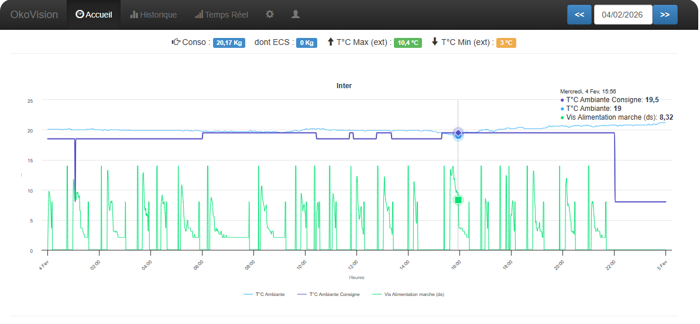
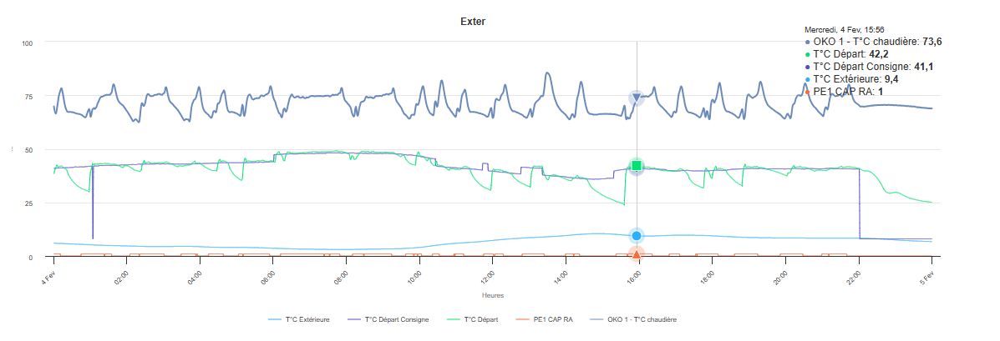
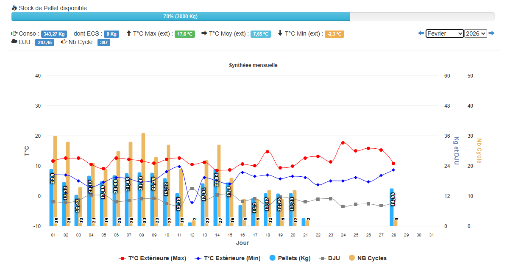
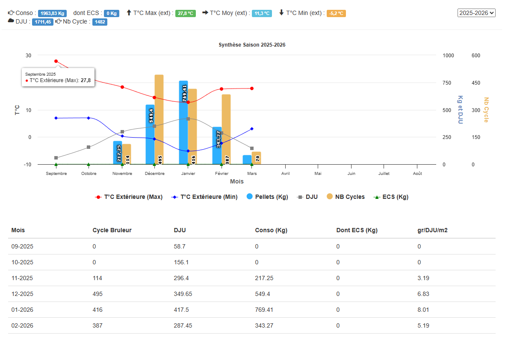

# OkoVision 2023


Web-based monitoring dashboard for **Okofen Pellematic** pellet boilers.  
Maintained project based on [Stawen/Okovision](https://github.com/stawen/okovision), updated for **PHP 8** and fixed for Raspberry Pi.
 
> Compatible with Okofen firmware **V2 & V3** over HTTP.

---

## Features

- 📊 **Real-time monitoring** — reads boiler data over HTTP
- 🕒 **Automatic history** — hourly data collection via cron job, stored in MariaDB
- 🖥️ **Web interface** — dashboard accessible from any browser
- 🔧 **PHP 8.2 compatible** — bugs fixed, runs on recent Raspberry Pi OS
- 📱 **Mobile ready** - Compatible with mobile web page usage

---

## Screenshots

| Dashboard | Dashboard2 |
|-----------|------------|
|  |  |

| Historic | Season |
|---------------|---------------|
|  |  |

---

## Quick Install (Linux)
 
The script auto-detects your distribution, installs the right PHP version, and handles updates without overwriting an existing installation.
 
**Supported distributions**: Debian 10/11/12, Ubuntu 20.04+, Raspberry Pi OS
 
> ⚠️ **Warning**: this script installs Apache2 and MariaDB. If they are already present on your machine, use the manual installation below to avoid conflicts.
 
```bash
sudo wget https://raw.githubusercontent.com/Domotrique/okovision_2023/master/install/Okovision_2023_for_Linux.sh \
  && sudo chmod +x Okovision_2023_for_Linux.sh \
  && sudo ./Okovision_2023_for_Linux.sh \
  && sudo rm -f Okovision_2023_for_Linux.sh
```
 
**What the script does:**
 
- Detects the OS and adds the PHP Sury repository if needed (Debian 11)
- Installs MariaDB, Apache2 and PHP 8.2 with all required extensions
- Creates the database and user (Please change your password afterward)
- Downloads OkoVision from GitHub
- Backs up any existing installation with a timestamp before replacing it
- Configures the Apache virtual host and hourly cron job
 
---
 
## Manual Installation (Linux)
 
### 1. Base tools
 
```bash
sudo apt-get update -y
sudo apt-get install -y ca-certificates curl wget gnupg lsb-release unzip
```
 
### 2. PHP 8.2 on Debian 11 (bullseye only)
 
On Debian 11, PHP 8.2 is not available in the official repositories — you need to add the Sury repository:
 
```bash
curl -fsSL https://packages.sury.org/php/apt.gpg | sudo gpg --dearmor -o /etc/apt/trusted.gpg.d/sury.gpg
echo "deb https://packages.sury.org/php/ bullseye main" | sudo tee /etc/apt/sources.list.d/sury-php.list
sudo apt-get update -y
```
 
> On Debian 12 / Ubuntu 22.04+, this step is not needed.
 
### 3. MariaDB database
 
 > ⚠️ **Warning**: Don't forget to change your password after completing the installation
```bash
sudo apt-get install -y mariadb-server
sudo systemctl enable --now mariadb
 
sudo mysql -e "CREATE DATABASE IF NOT EXISTS \`okovision\` CHARACTER SET utf8mb4 COLLATE utf8mb4_general_ci;"
sudo mysql -e "CREATE USER IF NOT EXISTS 'okouser'@'localhost' IDENTIFIED BY 'okopass';"
sudo mysql -e "GRANT ALL PRIVILEGES ON \`okovision\`.* TO 'okouser'@'localhost'; FLUSH PRIVILEGES;"
```
 
### 4. Apache2 web server + PHP 8.2
 
```bash
sudo apt-get install -y apache2
sudo a2enmod rewrite
sudo systemctl enable --now apache2
 
sudo apt-get install -y php8.2 php8.2-cli php8.2-common libapache2-mod-php8.2 \
  php8.2-mysql php8.2-mbstring php8.2-xml php8.2-curl \
  php8.2-gd php8.2-intl php8.2-zip
 
sudo systemctl restart apache2
```
 
### 5. OkoVision files
 
```bash
cd /var/www/
 
# Backup existing install if present
[ -d "okovision" ] && sudo mv okovision "$(date +"%y-%m-%d")_okovision"
 
sudo wget -O okovision.zip https://github.com/domotrique/okovision_2023/archive/refs/heads/master.zip
sudo unzip -q okovision.zip
sudo mv okovision_2023-master okovision
sudo rm okovision.zip
sudo chown -R www-data:www-data okovision/
```
 
### 6. Apache configuration
 
```bash
sudo cp /var/www/okovision/install/099-okovision.conf /etc/apache2/sites-available/
sudo a2ensite 099-okovision.conf
sudo a2dissite 000-default || true
sudo systemctl reload apache2
```
 
### 7. Cron job (hourly collection)
 
The cron fetches boiler data at minute 22 of every hour.
 
```bash
PHP_BIN="$(command -v php)"
CRONLINE="22 */1 * * * cd /var/www/okovision; ${PHP_BIN} -f cron.php"
( sudo crontab -l 2>/dev/null | grep -v "okovision; .*cron.php" || true; echo "$CRONLINE" ) | sudo crontab -
```
 
---
 
## Boiler Setup
 
### Step 1 — Network connection
 
Connect your boiler to your local network (network card located in the boiler door).
 

 
### Step 2 — Find the IP address
 
Go to **Main Menu → General → IP Config** to find your boiler's IP address.
 
> 💡 **Tip**: assign a static IP to your boiler in your router settings to prevent the address from changing.
 

 
You can also check or retrieve your Okofen app credentials (for remote access) from this same menu.
 
### Step 3 — Check HTTP access
 
Open a browser and navigate to:
 
```
http://YOUR_BOILER_IP/logfiles/pelletronic/
```
 
You should see something like this:
 

 
If this page loads, **the hardest part is done!** 🎉
 

 
---
 
## OkoVision Setup
 
Open your browser and go to `http://localhost` (or your machine's IP address).
 
For the full configuration guide, here is the official documentation:  
👉 [https://domotrique.github.io/okovision-2023-doc/](https://domotrique.github.io/okovision-2023-doc/)
 
---
 
## Default credentials
 
| Service    | Login     | Password  |
|------------|-----------|-----------|
| MySQL      | `okouser` | `okopass` |
| OkoVision  | `admin`   | `okouser` |
 
> ⚠️ Make sure to change these credentials after installation in a production environment.
 
---
 
## Reporting an issue
 
If something is not working as expected, [open an issue](https://github.com/Domotrique/okovision_2023/issues/new/choose) and I will try to have a look as soon as possible.
 
---
 
## Credits
 
- Based on [Stawen/Okovision](https://github.com/stawen/okovision) — original project no longer maintained
- Tested on **Okofen Pellematic Compact** with firmware V2 & V3
 
<!-- SEO: okovision okofen raspberry pi php8 home automation pellet boiler monitoring php 8 raspberrypi -->